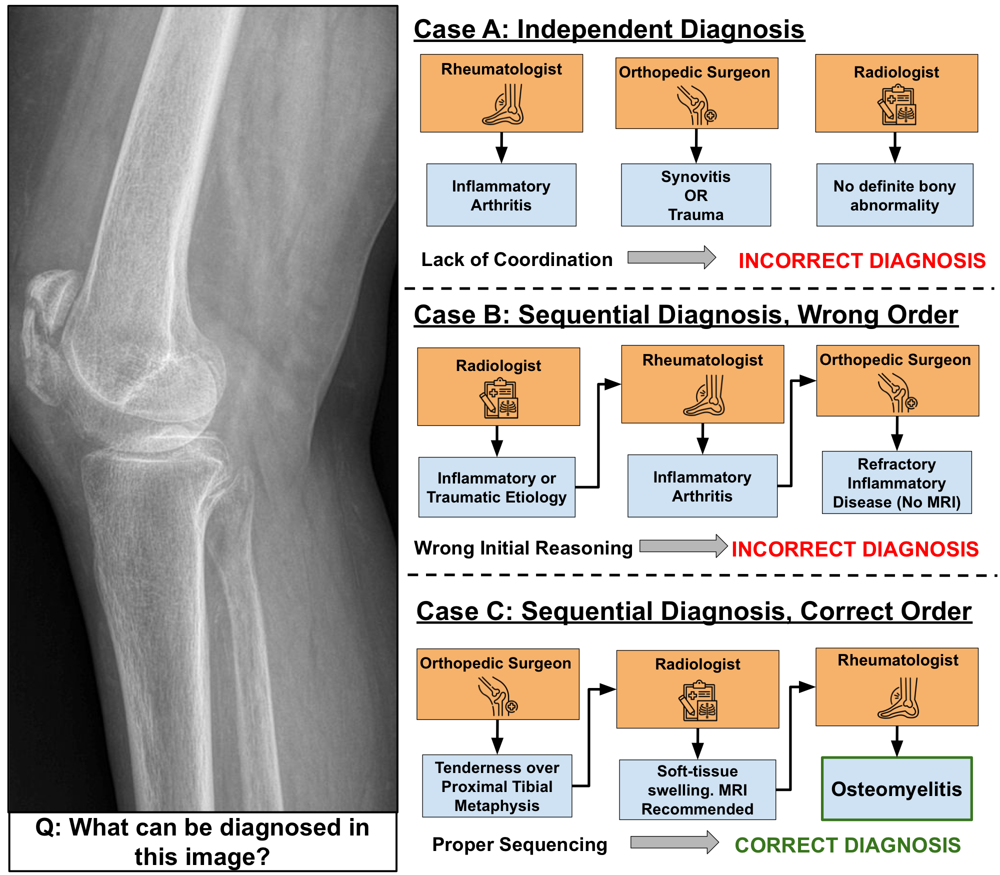
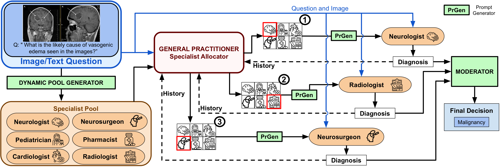
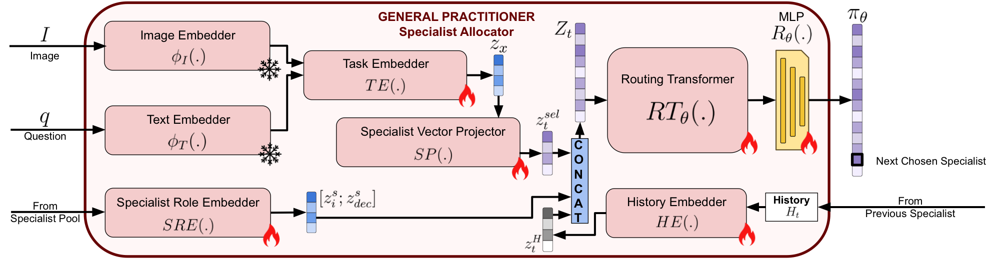
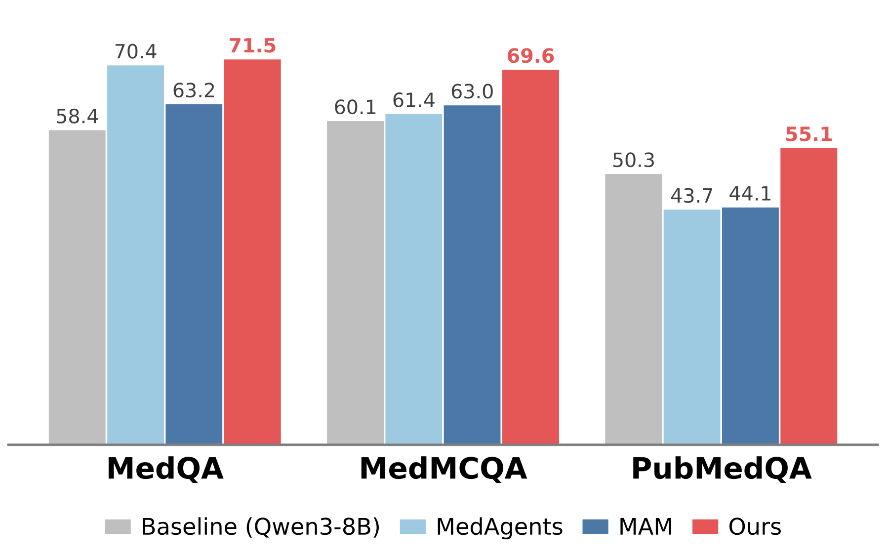
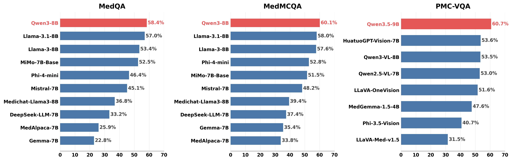
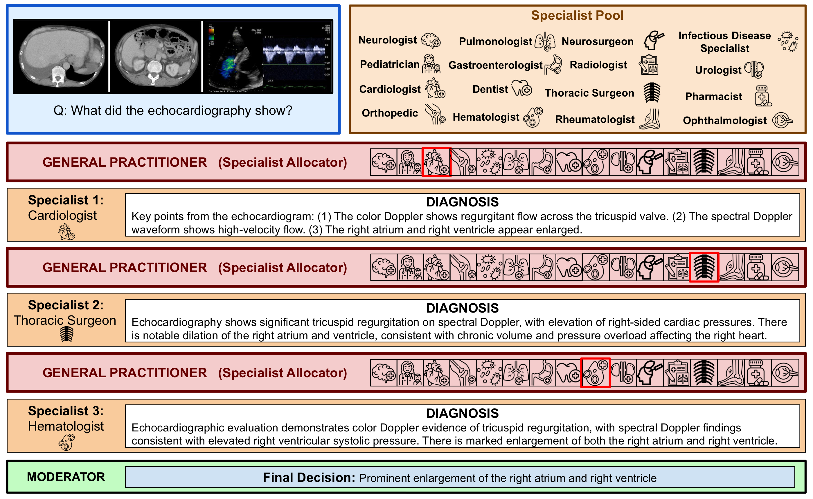

<h1 align="center"> MedRoute: Dynamic Specialist Routing for Multi-Agent Medical Diagnosis </h1>

<p align="left">
   <a href="https://ashmalvayani.github.io/MedRoute/"></a>
   <a href="https://arxiv.org/abs/2604.06180"></a>
   <a href="https://github.com/ashmalvayani/MedRoute/blob/main/LICENSE"></a>
</p>

[Ashmal Vayani](https://ashmalvayani.github.io/)\*, [Parth Parag Kulkarni](https://scholar.google.com/citations?user=OHC7c90AAAAJ&hl=en)\*, [Joseph Fioresi](https://scholar.google.com/), [Song Wang](https://scholar.google.com/), [Mubarak Shah](https://scholar.google.com/citations?user=p8gsO3gAAAAJ&hl=en&oi=ao)
###### \* Equal Contribution

#### University of Central Florida

<h5 align="left"> If you find our work useful, please give us a star ⭐ on GitHub for the latest updates.</h5>

#### Official GitHub repository for `MedRoute: Dynamic Specialist Routing for Multi-Agent Medical Diagnosis`.
---

## 📢 Latest Updates
- **Jun-06-26** — Code released. 🔥
- **Jun-06-26** — Technical report of MedRoute released on [arXiv](https://arxiv.org/abs/2604.06180). 🔥

---

## 🏆 Highlights

<p align="center">
   
</p>

> <p align="justify"> <b><span style="color: blue;">Figure:</span></b> <b>History-conditioned specialist routing for medical diagnosis.</b> The same knee X-ray can lead to different outcomes depending on how specialist consultations are coordinated. Poorly ordered consultations may produce incorrect diagnoses, whereas <b>MedRoute</b> uses accumulated diagnostic history to select the next specialist and construct a coherent consultation trajectory, leading to the correct osteomyelitis prediction. </p>

> **<p align="justify"> Abstract:** Large Multimodal Models (LMMs) have shown promising diagnostic ability in medical reasoning, yet they are typically used as monolithic generalists or as agents assigned to static clinical roles. Existing multi-agent medical systems improve specialization through fixed expert panels, role-based discussion, or external knowledge augmentation, but their coordination is often weakly adaptive and not directly optimized for final diagnostic correctness. We propose **MedRoute**, a reinforcement-learning-based framework that formulates multi-agent medical diagnosis as a learned consultation policy. For each case, MedRoute constructs a compact, case-conditioned specialist pool and instantiates specialists with targeted clinical guidance. A General Practitioner (GP) then dynamically selects specialists conditioned on the input and accumulated diagnostic history, allowing each consultation to inform the next rather than producing individual expert opinions. To address the lack of step-wise supervision signals, we train the router with an outcome-level policy-gradient objective using group-relative advantage normalization, assigning credit to consultation trajectories based on final diagnostic correctness. A Moderator synthesizes the resulting diagnostic trajectory into the final prediction. Across three text-only and five image-text medical QA benchmarks, MedRoute consistently outperforms both single-model and multi-agent baselines, with gains of up to **+13.1%** on text-only and **+30.4%** on image-text over the strongest single-model baseline. </p>

**Main contributions:**
1. **`Adaptive multi-agent framework:`** We introduce MedRoute, a novel and adaptive multi-agent framework that formulates multimodal medical diagnosis as an outcome-optimized consultation routing problem, where the agentic system learns the most suitable sequence of specialist consultations based on the evolving diagnostic history.
2. **`General Practitioner router:`** We design a router (the General Practitioner) that adaptively conditions each routing decision on the input case and accumulated diagnostic history, allowing specialist opinions to guide subsequent consultations rather than being generated independently.
3. **`Outcome-level policy gradient training:`** We train the router from final diagnostic outcomes using Group-Relative Policy Optimization (GRPO) and demonstrate substantial gains across eight medical QA benchmarks (three text-only, five image-text), outperforming both single-model and multi-agent state-of-the-art baselines.

<hr />

## 🩻 Method

### Framework Overview
<p align="center">
   
</p>

> <p align="justify"> <b><span style="color: blue;">Figure: MedRoute pipeline.</span></b> For each case, a case-conditioned specialist pool is generated and specialists are instantiated with targeted clinical guidance. The General Practitioner (GP) router dynamically selects the next specialist conditioned on the input case and the accumulated diagnostic history. After up to <i>K</i> consultations, the Moderator synthesizes the diagnostic trajectory into the final prediction. </p>

### General Practitioner Router
<p align="center">
   
</p>

> <p align="justify"> <b><span style="color: blue;">Figure: General Practitioner router.</span></b> A lightweight GNN-conditioned transformer encodes the case representation and the current diagnostic history into a routing distribution over the case-conditioned specialist pool. Trained end-to-end with GRPO, the router is supervised by the final diagnostic outcome of complete consultation trajectories. </p>

<hr />

## 🗂️ Datasets

MedRoute is evaluated across **eight** medical QA benchmarks — three text-only and five image-text:

| Dataset | Modality | Task | Test set |
|---|---|---|---|
| [MedQA](https://github.com/jind11/MedQA) | text | 5-option USMLE-style MCQ | 1,273 |
| [MedMCQA](https://github.com/medmcqa/medmcqa) | text | 4-option MCQ (Indian medical entrance) | 2,816 |
| [PubMedQA](https://pubmedqa.github.io/) | text | yes/no/maybe QA on PubMed abstracts | 1,000 |
| [PMC-VQA](https://xiaoman-zhang.github.io/PMC-VQA/) | image-text | 4-option VQA on PubMed figures | 2,000 |
| [PathVQA](https://github.com/UCSD-AI4H/PathVQA) | image-text | open-ended pathology VQA | 6,719 |
| [DeepLesion](https://nihcc.app.box.com/v/DeepLesion) | image-text | NIH lesion identification | 4,736 |
| [ChestX-ray8](https://nihcc.app.box.com/v/ChestXray-NIHCC) | image-text | NIH chest X-ray classification | 17,853 |
| [BTMRI](https://www.kaggle.com/datasets/sartajbhuvaji/brain-tumor-classification-mri) | image-text | brain tumor MRI classification | 394 |

Data files are **not bundled** in this repo. Each dataset has its own README with download instructions under [`AnyMAC-Improved/datasets_my/<DATASET>/`](AnyMAC-Improved/datasets_my/).

<hr />

## 🛠️ Installation

### 1. Clone and create a virtual environment

```bash
git clone https://github.com/ashmalvayani/MedRoute.git
cd MedRoute/AnyMAC-Improved
python -m venv venv
source venv/bin/activate
```

### 2. Install PyTorch (CUDA) + vLLM + remaining dependencies

```bash
# PyTorch with CUDA
pip install torch torchvision torchaudio --index-url https://download.pytorch.org/whl/cu128

# vLLM (inference backend)
pip install vllm

# remaining dependencies
pip install -r requirements.txt
```

### 3. (Optional) configure environment

```bash
cp .env.template .env
# edit .env to set BASE_URL, JUDGE_BASE_URL, API_KEY, etc.
```

Defaults: `BASE_URL=http://localhost:8000`, `JUDGE_BASE_URL=http://localhost:8001`.

### 4. Download datasets

Each dataset has its own download instructions:

```
AnyMAC-Improved/datasets_my/MedQA/README.md
AnyMAC-Improved/datasets_my/PubMedQA/README.md
AnyMAC-Improved/datasets_my/MedMCQA/README.md
AnyMAC-Improved/datasets_my/btmri/README.md
AnyMAC-Improved/datasets_my/ChestXray8/README.md
AnyMAC-Improved/datasets_my/DeepLesion/README.md
AnyMAC-Improved/datasets_my/PathVQA/README.md
AnyMAC-Improved/datasets_my/PMC-VQA/README.md
```

### 5. (Vision datasets) precompute SigLIP image embeddings

```bash
python -m GDesigner.llm.image_embedding \
    --dataset pmcvqa \
    --vision_encoder google/siglip-so400m-patch14-384 \
    --split test
```

SigLIP is the default and is used for all reported results. CLIP / DINOv2 / BiomedCLIP variants live in [`scripts/ablations/`](AnyMAC-Improved/scripts/ablations/) for comparison.

<hr />

## 🚀 Usage

All commands run from the `AnyMAC-Improved/` directory. The shell scripts in `scripts/` auto-launch vLLM (specialist + judge), train the router, and evaluate — one command per dataset.

### Train + evaluate

```bash
bash scripts/train_medqa.sh        # MedQA
bash scripts/train_pubmedqa.sh     # PubMedQA
bash scripts/train_medmcqa.sh      # MedMCQA
bash scripts/train_btmri.sh        # BTMRI
bash scripts/train_chestxray8.sh   # ChestX-ray8
bash scripts/train_deeplesion.sh   # DeepLesion
bash scripts/train_pathvqa.sh      # PathVQA
bash scripts/train_pmcvqa.sh       # PMC-VQA
```

### Baseline (no routing)

Single-model baseline — generates answers with the specialist LMM alone and judges with a separate judge model:

```bash
bash scripts/run_baseline_medqa.sh        # …or any of the eight datasets
```

### Run experiments interactively

If you'd rather invoke the Python entry points directly (e.g., to override flags), every dataset has one:

```bash
python experiments/run_medqa.py \
    --llm_name Qwen/Qwen3-8B \
    --judge_model Qwen/Qwen2.5-32B-Instruct \
    --epochs 1 --train_num 300 --max_routing 3 \
    --num_traces 16 --trace_parallelism 16 \
    --dynamic_prompts --dynamic_pool
```

Judging happens in-process inside the train/evaluate scripts (they call the judge LLM directly via the OpenAI-compatible API). There is no separate judge-only script.

### Key CLI flags

| Flag | Default | What it does |
|---|---|---|
| `--epochs` | 1 | Training epochs |
| `--train_num` | 300 | Number of training questions |
| `--max_routing` | 3 | Max specialist hops per case |
| `--num_traces` | 16 | GRPO rollouts per case |
| `--trace_parallelism` | 16 | Concurrent vLLM requests |
| `--llm_name` | `Qwen/Qwen3-8B` | Specialist model |
| `--judge_model` | (per-script) | Reward / answer judge |
| `--dynamic_prompts` | off | Generate question-specific guidance for each specialist before they answer |
| `--dynamic_pool` | off | Generate a 5–7 specialist panel per question instead of routing over the fixed 60-specialist pool |
| `--routing_policy` | `learned` | `learned` (default), `random` (uniform ablation), or `fixed` (deterministic sequence) |
| `--fixed_route` | `""` | Comma-separated specialist sequence used when `--routing_policy fixed`, e.g. `"Cardiologist,Neurologist"` |
| `--use_image_embeddings` | off | Enable image-embedding routing (vision datasets) |
| `--vision_encoder` | `google/siglip-so400m-patch14-384` | Vision encoder for image embeddings |
| `--train_json_path` / `--test_json_path` | unset | Override default dataset paths with a custom JSON file |
| `--dm_cot` | off | Decision-maker chain-of-thought (used in PMC-VQA) |

### LLM backend

All LLM calls use the OpenAI-compatible `/v1/chat/completions` API:
- **vLLM** (recommended) — auto-launched by the shell scripts; high-throughput continuous batching
- **OpenAI / Azure OpenAI** — set `API_KEY` and `BASE_URL` accordingly
- Any other OpenAI-compatible server

Environment variables:
- `BASE_URL` — specialist model endpoint (default `http://localhost:8000`)
- `JUDGE_BASE_URL` — judge model endpoint (default `http://localhost:8001`)
- `API_KEY` — API key (default `EMPTY`, accepted by vLLM)

Default models:

| GPU | Model | Purpose |
|---|---|---|
| 0 | `Qwen/Qwen3-8B` (text) or `Qwen/Qwen3.5-9B` (vision) | Specialist agent calls |
| 1 | `Qwen/Qwen2.5-32B-Instruct` (text) or `Qwen/Qwen3-32B` (vision) | Reward / answer judge |

<hr />

## 📊 Results

### Text-only benchmarks
<p align="center">
   
</p>

> <p align="justify"> <b><span style="color: blue;">Figure:</span></b> MedRoute outperforms the strongest single-model baseline (Qwen3-8B) and the multi-agent baseline MAM on MedQA, MedMCQA, and PubMedQA. Gains reach <b>+13.1%</b> on MedQA over the single-model baseline. </p>

### Image-text benchmarks
<p align="center">
   
</p>

> <p align="justify"> <b><span style="color: blue;">Figure:</span></b> MedRoute improves over single-model and multi-agent baselines across five image-text benchmarks (PMC-VQA, PathVQA, DeepLesion, ChestX-ray8, BTMRI). Gains reach <b>+30.4%</b> on BTMRI over the strongest single-model baseline. </p>

<hr />

## 🔬 Qualitative Examples

<p align="center">
   
</p>

> <p align="justify"> <b><span style="color: blue;">Figure:</span></b> Across diverse medical cases, MedRoute selects a coherent sequence of specialists conditioned on the diagnostic history. Each specialist's reasoning shapes the next routing decision, and the Moderator integrates the trajectory into the final answer. </p>

<hr />

## 📁 Repository structure

```
MedRoute/
├── AnyMAC-Improved/
│   ├── GDesigner/
│   │   ├── agents/         # Agent definitions (specialist, decision maker)
│   │   ├── domain/         # Domain configs per dataset
│   │   ├── gnn/            # Graph neural network modules
│   │   ├── graph/          # Core routing graph + GRPO training logic
│   │   ├── llm/            # LLM backend + image embedding
│   │   ├── prompt/         # Specialist prompts + dynamic prompt generator
│   │   ├── transformer/    # Routing transformer architecture
│   │   └── utils/          # Helpers
│   ├── datasets_my/        # Dataset loaders + folder skeletons (data not bundled)
│   ├── experiments/        # Training / evaluation / baseline Python entry points
│   ├── scripts/            # Shell wrappers — auto-launch vLLM + run experiments
│   │   └── ablations/      # Vision-encoder + routing-policy ablations
│   ├── requirements.txt    # Python dependencies
│   └── .env.template       # Environment configuration template
├── MAM/                    # Modular Multi-Agent reference work (separate paper)
├── Assets/                 # README figures
└── README.md
```

<hr />

## 📂 License
This work is licensed under a Creative Commons Attribution-NonCommercial-ShareAlike 4.0 International License. Dataset images come from publicly available medical QA benchmarks (see the per-dataset READMEs and main paper for details) and are for academic research use only.

## 📜 Citation

If you find our work and this repository useful, please consider giving the repo a ⭐ and citing our paper:

```bibtex
@article{vayani2026medroute,
  title={MedRoute: RL-Based Dynamic Specialist Routing in Multi-Agent Medical Diagnosis},
  author={Vayani, Ashmal and Kulkarni, Parth Parag and Fioresi, Joseph and Wang, Song and Shah, Mubarak},
  journal={arXiv preprint arXiv:2604.06180},
  year={2026}
}
```

## 🙏 Acknowledgements

This repository builds on top of the open-source [AnyMAC](https://github.com/) routing framework and draws inspiration from the [MAM](https://aclanthology.org/2025.findings-acl.1298/) modular multi-agent medical framework. We thank the authors for releasing their code.

---
<p align="center">
   <a href="https://www.crcv.ucf.edu/"></a>
</p>
